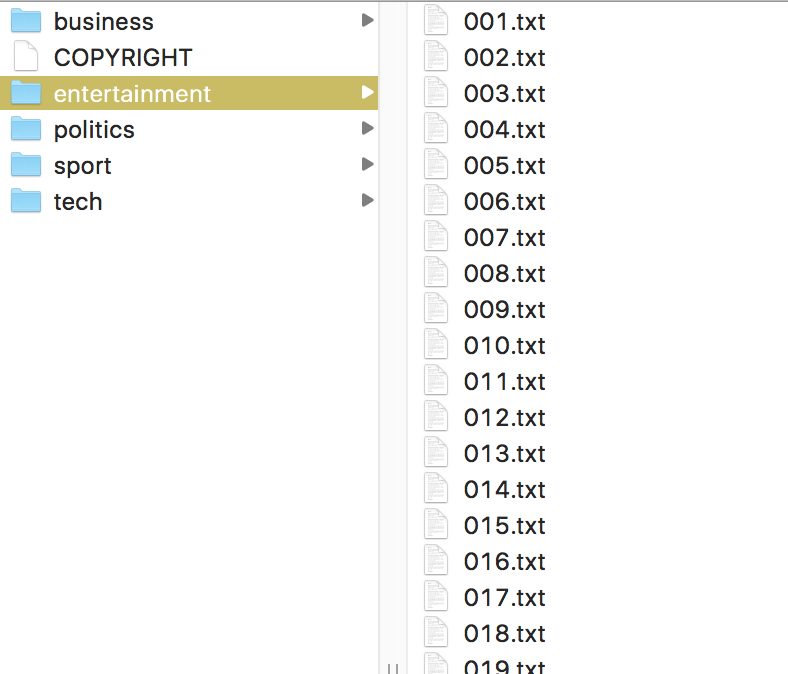

# Recommending Articles

The project was a part of MSDS692 course and the goal of this project was to learn how to make a simple article recommendation engine using a semi-recent advance in natural language processing called [word2vec](http://arxiv.org/pdf/1301.3781.pdf) (or just *word vectors*). In particular, I have used [Stanford's GloVe project](https://nlp.stanford.edu/projects/glove/) trained on a dump of Wikipedia for the word embeddings. 

Around the recommendation engine, I also built a web server that displays a list of [BBC](http://mlg.ucd.ie/datasets/bbc.html) articles for URL `http://localhost:5000` (testing) or whatever the IP address is of your Amazon server (deployment):


Clicking on one of those articles takes you to an article page that shows the text of the article as well as a list of five recommended articles:


### Article word-vector centroids

In a nutshell, each word has a vector of, say, 300 floating-point numbers that somehow capture the meaning of the word, at least as it relates to other words within a corpus. These vectors are derived from a neural network that learns to map a word to an output vector such that neighboring words in some large corpus are close in 300-space. ("The main intuition underlying the model is the simple observation that ratios of word-word co-occurrence probabilities have the potential for encoding some form of meaning." see [GloVe project](https://nlp.stanford.edu/projects/glove/).)

Two words are related if their word vectors are close in 300 space. Similarly, if we compute the centroid of a document's cloud of word vectors, related articles should have centroids close in 300 space. Words that appear frequently in a document push the centroid in the direction of that word's vector. The centroid is just the sum of the vectors divided by the number of words in the article. Given an article, we can compute the distance from its centroid to every other article's centroid. The article centroids closest to the article of interest's centroid are the most similar articles. Surprisingly, this simple technique works well as you can see from the examples above.

Given a word vector filename, such as `glove.6B.300d.txt`, and the root directory of the BBC article corpus, we will use the following functions from `doc2vec.py` in the main `server.py` file to load them into memory:

```python
# get commandline arguments
i = sys.argv.index('server:app')
glove_filename = sys.argv[i+1]
articles_dirname = sys.argv[i+2]
```

The `gloves` variable is the dictionary mapping a word to its 300-vector vector. The `articles` is a list of records, one for each article. An article record is just a list containing the fully-qualified file name, the article title, the text without the title, and the word vector computed from the text without the title.

Then to get the list of most relevant five articles, we'll do this:

```python
seealso = recommended(doc, articles, 5)
```


### Web server

Besides those core functions, I also built a web server using flask. See the video on [how to launch a flask web server at Amazon](https://www.youtube.com/watch?v=qQncEJL6NHs&t=156s). We need to use [gunicorn](http://gunicorn.org/) because the "... *Flask’s built-in server is not suitable for production as it doesn’t scale well and by default serves only one request at a time.*" (from the doc). See [Standalone WSGI Containers](http://flask.pocoo.org/docs/1.0/deploying/wsgi-standalone/) for more on using flask with gunicorn. The server should respond to two different URLs: the list of articles is at `/` and each article is at something like `/article/business/353.txt`. The BBC corpus in directory `bbc` is organized with topic subdirectories and then a list of articles as text files:



So, if you are testing and from your laptop, you would go to the following URL in your browser to get the list of articles:

`http://localhost:5000/`

And to get to a specific article you would go to:

`http://localhost:5000/article/business/030.txt`

The `localhost:5000` will be replaced with an IP address plus `:5000' or some machine name given to you by Amazon when you deploy your server.


